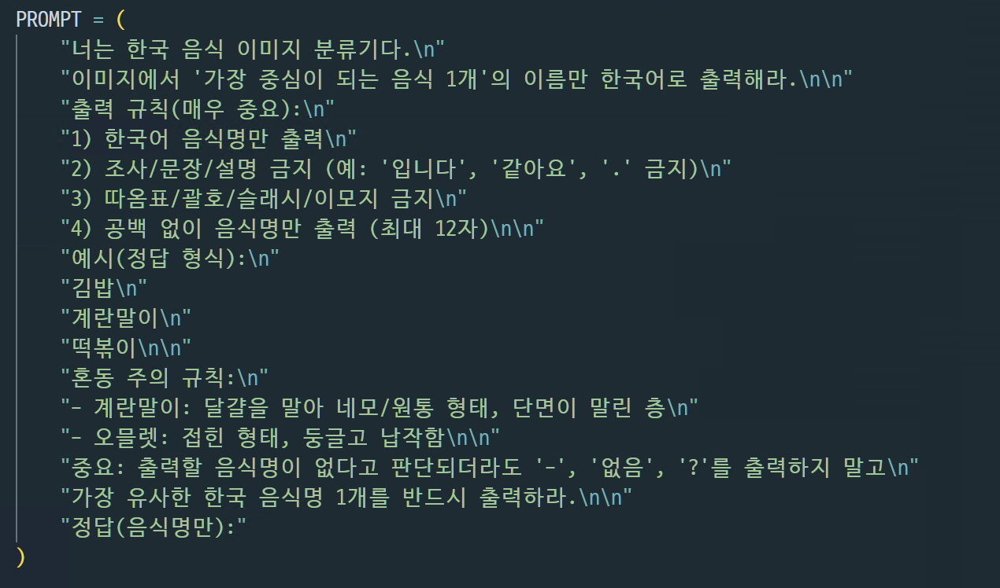

# VLM Training

BaseModel : Qwen 2.5 VL 3B (Hugging Face)

Data set : AI - Hub한국 이미지 (음식), 150 종 (약 15만개의 이미지 데이터 사용)

---

# 모델 선정 이유

> 음식 인식은 단순 탐지가 아니라 사용자 입력 사진의 맥락 (혼합 메뉴 / 가정식 / 브랜드 조립법/ 부분 가림) 을이해해 , RAG 검색에 바로 쓰는 정규화된 음식명을 안정적으로 뽑는것이 핵심이라 VLM 을 사용
> 

### 탐지는 박스를 잘 찾는 문제고 푸디의 기능은 대표 음식 정규화 → 영양소 검색을 하나의 모델로 빠르게 도입하는 것이 목적

- 한국인의 다빈도 섭치 외식메뉴 400종이 학습된 Yolo v3 모델이 존재

[AI-Hub](https://aihub.or.kr/aihubdata/data/view.do?currMenu=115&topMenu=100&dataSetSn=74)

- 하지만 학습 데이터의 클래스 범위 밖에는 영양성분, 음식 이름 추론이 상대적으로 약하다.
- 그에 비해 VLM 은 이미지 + 텍스트 기반 지식이기 때문에 클래스 외에도 일반화가 상대적으로 쉽고, 
LoRA 학습을 통해 도메인 확정을 빠르게 할 수 있다.
→ ***운영 중 지속 개선 가능한 구조가 가능***

---

# Base Model의 문제점

### 1. LLM 모델 기반으로 단순히 **음식명만을 추론하기 어렵다**

→ 음식 명 추론 프롬프트

- 해당 프롬프트를 사용하더라도 한국어로 답변하지 않고 문자가 깨지거나 외국어가 섞어 나오는 문제점이 존재

***150종 테스트 결과 정확도 4% 를 보여주고 있다***

### 2. 한국 음식에 대해서는 낮은 정확도 (학습 데이터 분포 문제)

- 떡볶이 → 파스타
- 계란말이 → 오믈렛

- Qwen 계열 VLM 은 글로벌 이미지, 텍스트 데이터 비중이 높다
- 한국음식 같은 경우 외형이 유사한 메뉴가 많고 (ex. 국, 찌개, 볶음),
명칭이 조리법, 재료 지역에 따라 세분화 되어간다.

***한국 음식데이터에 대한 데이터 분포를 확장하는 것이 필요***

---

# 학습 전략

### 1. LoRA (Low-Rank Adaption) 및 QLoRA 기반 Fine-Tuning

- 전체 모델을 학습하는 대신, LoRA 어댑터만 학습하여 메모리 사용량 절감
- 전체 모델 대비 학습 가능한 파라미터를 2%미만으로 축소 하면서도, 타겟(한국 음식)에 대한 높은 성능을 유지
- Double Quantization : 양자화 상수 자체에서도 양자화하여 추가 메모리 절감 유도

| **파라미터** | **기본값** | 설명 |
| --- | --- | --- |
| `lora_r` | `16` | LoRA Rank |
| `lora_alpha` | `32` | LoRA Scaling Factor |
| `lora_dropout` | `0.05` | LoRA Dropout Rate |
| `lora_target_modules` | 7개 모듈 | `q_proj`,  `k_proj`, `v_proj`, `o_proj`, `gate_proj`, `up_proj`, 
`down_proj` |

### 2. Image Token Explosion 방지

- Vision-Language 모델 특성상 이미지가 너무 많은 토큰으로 변환되어 메모리가 폭발하는 문제 존재
1. 이미지 리사이징 : 224 * 224 로 리사이즈 작업
2. 이미지 + 텍스트 합산 1536 (Max Length 제한)
3. Tail-Preserving Truncation : 길이 초과 시 앞부분을 잘라내고 뒷부분을 보존
(정답 토큰은 뒤에 있기 때문에 정답손실을 최소화 하도록 유도)

Loss Masking 을 이용하여 프롬프트는 음수 가중치(-100)을 부여하여 학습을 진행시키지 않고,
 정답만 학습하여 Pytorch 가 정답만 집중하도록 유도

### 3. Chat Template 기반 학습 데이터 구성

- Qwen 모델의 ‘apply_chat_temolate’ 메서드 활용하여 모델의 대화 형식에 맞게 데이터 구성
- User : 이미지 + 프롬프트, Assistant : 정답(음식명)

- 학습 프롬프트

### 4. 답변(정답) Label 전처리

- 학습 csv 에서 음식명이 모델의 출력할 형식과 일치하도록 전처리
→ 학습 데이터와 추론 결과의 일관성을 보장
- 공백, 특수문자 제거, 최대 토큰 제한

### 5. 단계 학습

- 메모리 제약 조건을 해결하기 위해 전체 데이터셋을 나누어 점진적 학습 진행
- 초기, 중기, 후기 로 나누어 학습률을 다르게 하여 모델이 수렴하도록 유도

1. **초기 (Learning Rate : 8e-5)
- 사전 학습된 Qwen 모델을 한국 음식 도메인에 빠르게 적응시키기 위한 목적
- Loss를 빠르게 떨어뜨리기 위함**

1. **중기 (Learning Rate : 5e-5)**
- 이미 학습된 지식을 유지하면서 정교한 패턴 학습
- 초기에 비해 급격한 가중치 변화 방지 및 과적합 없이 성능 향상 목적

2. **후기 (Learning Rate : 2e-5)
- 최적점 근처에서 세밀하게 조정 (Fine-Grained)
- 새로운 데이터 추가 시에도 기존 지식 보존**

### 6. Data (Ai-Hub K-Food 공개 데이터 셋)

[AI-Hub](https://aihub.or.kr/aihubdata/data/view.do?currMenu=115&topMenu=100&dataSetSn=79)

클래스 : 150

총 학슴 샘플 수 : 약 4,000 개

학습 환경에 따른 메모리 폭발 문제를 방지하기 한 클래스당 평균 20개 균형 분포 형식으로 버전을 나누어 점진적 학습 진행

### 기타

- Gradient Accumulation : 8 steps
- Gradient Ceckpointing : 중간 활성화 값을 메모리에 제거하고 역전파 시 재계산
- adamw_8big : Optimizer 상태를 8bit 로 저장하여 메모리 축소
- FP16 Mixed Precisiton

---

성과

### 기존 모델 대비 약 65% 향상 ( 4 % → 69%)

- 한식 모델 클래스 150개 기반 테스트 진행

### 테스트 결과

- 정답 개선

- 오답 값이지만, 외국어 혼용, 글씨가 깨지는 문제 해결

### 실제 서비스 결과

